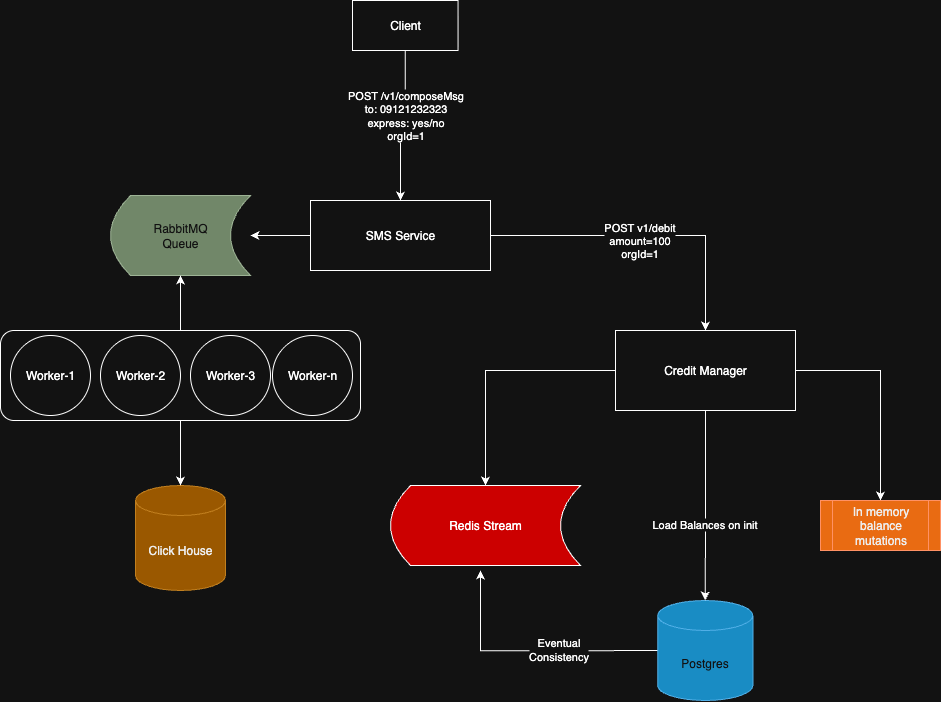
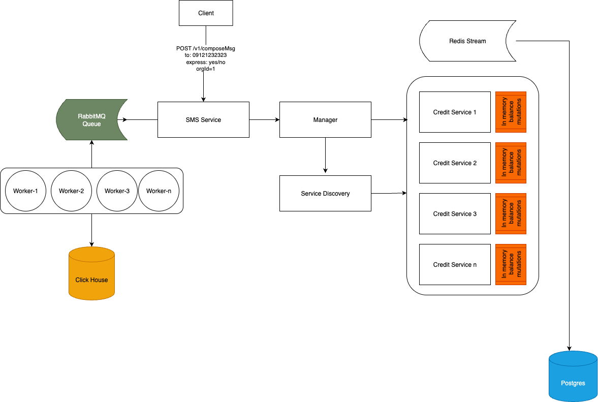

# SMS Service Architecture

## High-Level Design

## 1. Credit Management Service

This service is responsible for managing and validating the credit balance of each organization.

### Key Features:

**In-memory mutational credits:**  
Used to handle highly concurrent credit operations efficiently without database contention.

**Redis Streams:**  
Used for asynchronous updates and message passing, ensuring eventual consistency between in-memory state and persistent storage.

**PostgreSQL:**  
Acts as the source of truth for credit balances, ensuring durable storage and recoverability.

### Outcome:
The combination of in-memory processing, Redis Streams, and PostgreSQL provides a balance between real-time performance and data consistency.

## 2. SMS Delivery Service

This service is responsible for sending SMS messages, recording delivery activities, and integrating with SMS providers.

### Architecture and Design

To achieve scalability, fault tolerance, and predictable latency, the SMS delivery workflow is divided into two main categories of traffic:

**Express Queue:** For high-priority or time-sensitive SMS messages.  
**Normal Queue:** For standard, less time-critical messages.

Each queue has its own dedicated consumers and is processed independently to ensure isolation between workloads.

### Concurrency and Availability

On the consumer side, each process manages its workload using goroutines to handle concurrent message processing.  
This design enables:

**Horizontal Scalability:**  
Multiple consumer instances (one per queue) can be deployed across nodes.  
If one instance fails, others continue processing, ensuring high availability.

**Vertical Concurrency:**  
Within each consumer, goroutines provide fine-grained concurrency, maximizing CPU and I/O efficiency for SMS provider calls.

**Predictable Latency and Throughput:**  
By combining:

- Knowledge of peak traffic patterns per organization,  
- Provider response times, and  
- Internal service latency,  

the system can estimate and configure the optimal number of consumer processes and goroutines required to meet delivery time guarantees.

### ClickHouse Integration:
All activity logs are stored in ClickHouse, supporting high-volume time-series data insertion (millions of records per day) and fast analytical queries.

### Outcome

This architecture allows the service to:

- Dynamically scale per traffic type (express/normal),  
- Maintain availability even under failure conditions, and  
- Ensure timely SMS delivery during traffic peaks.

---

## Scalable Version

